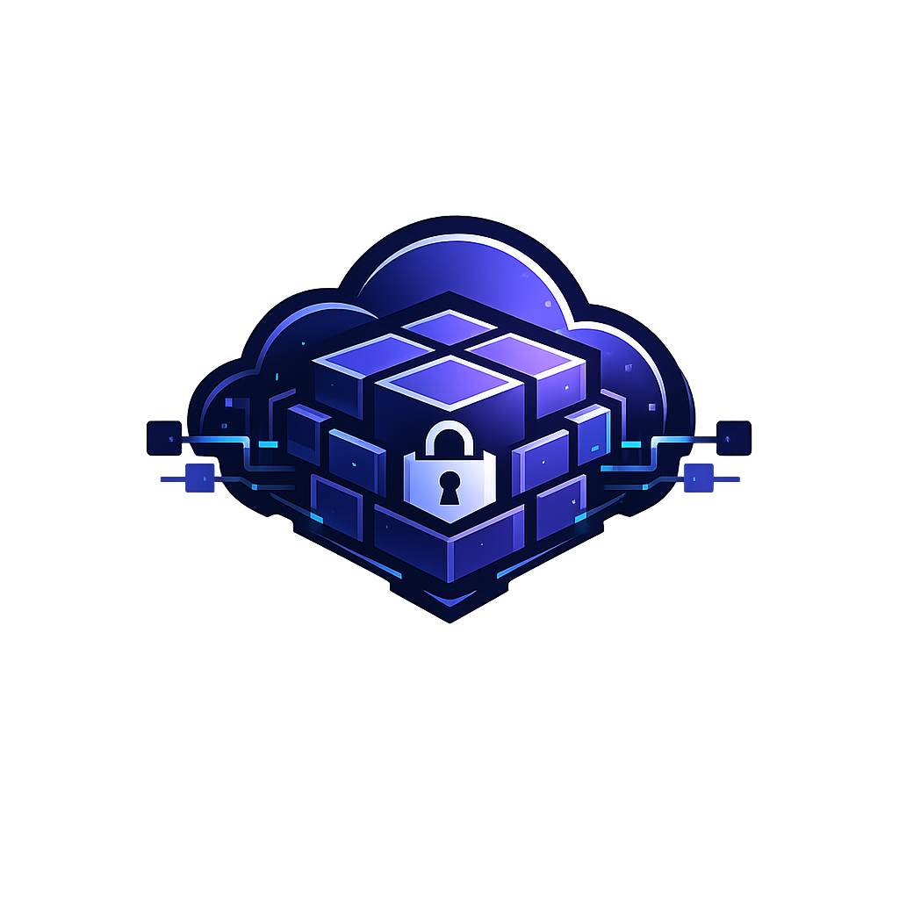
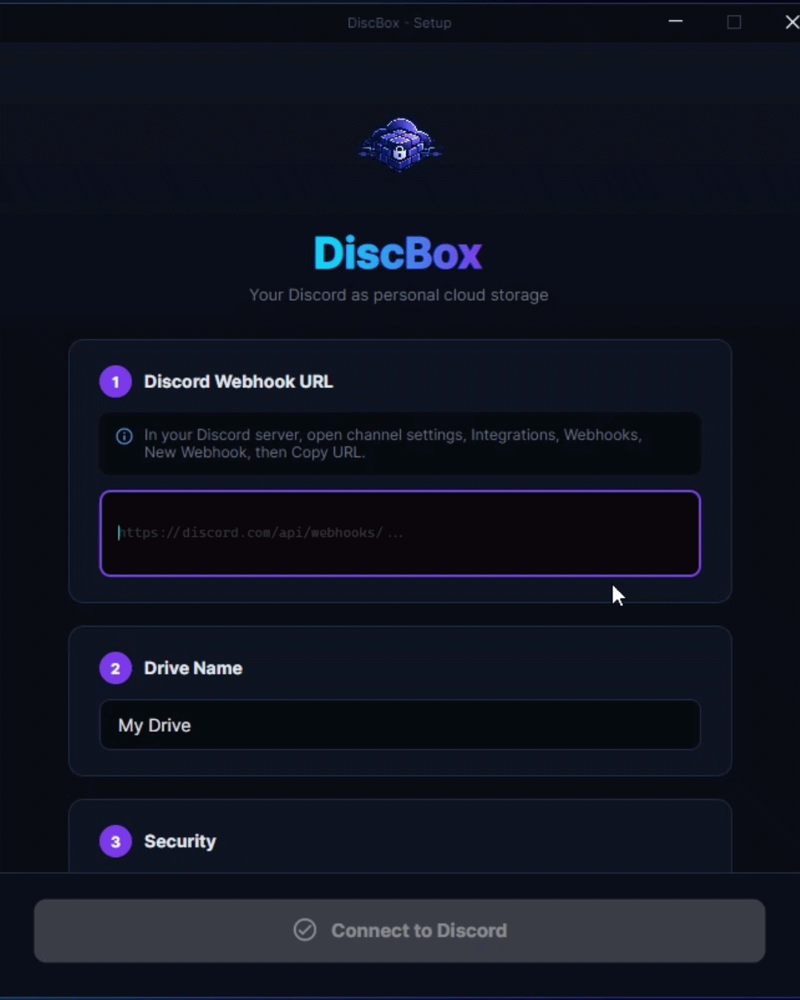
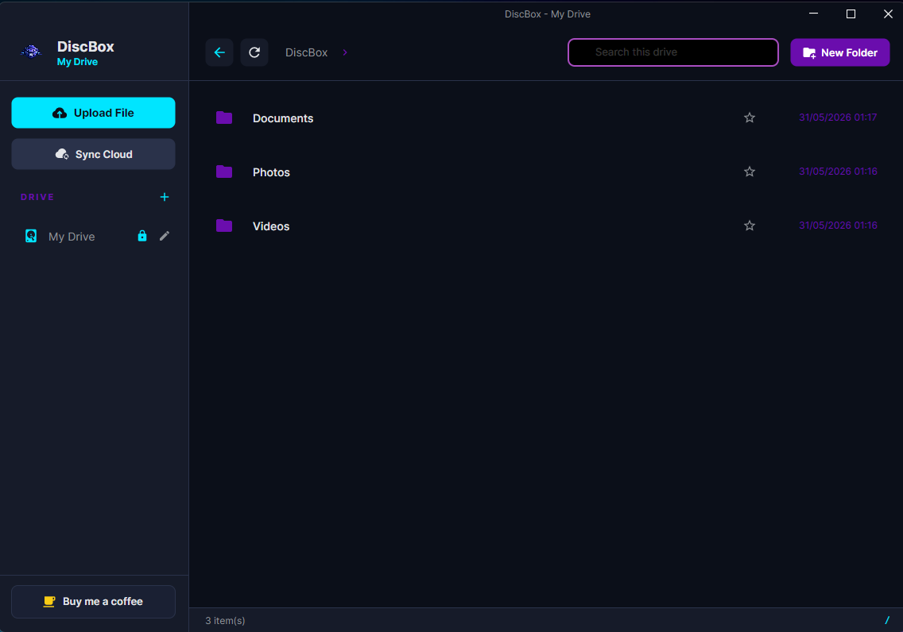

<div align="center">



# DiscBox

### Your personal cloud drive powered by Discord.

DiscBox is a desktop cloud storage application that lets you use Discord as a private storage backend.
Upload, download, organize, and manage your files through a clean drive-like interface.

<br />

[](https://github.com/JohnnyMeister/DiscBox/releases)
[](https://github.com/JohnnyMeister/DiscBox/releases)
[](#)
[](LICENSE)

<br />

[Download DiscBox](https://github.com/JohnnyMeister/DiscBox/releases/latest)

</div>

---

## Overview

DiscBox turns Discord into a personal cloud drive.

Instead of using a traditional cloud provider, DiscBox stores your files through Discord webhooks. Files are split into chunks, uploaded to Discord, indexed locally, and restored when downloaded.

The application gives you a familiar desktop file manager experience while using Discord as the remote storage layer.

---

## Download

The easiest way to install DiscBox is through the latest GitHub release.

### Step 1: Open the latest release page

Click the button below:

[Download the latest version of DiscBox](https://github.com/JohnnyMeister/DiscBox/releases/latest)

### Step 2: Find the Assets section

On the release page, scroll down until you see **Assets**.

This is where the downloadable files are listed.

### Step 3: Choose the correct download

Download one of these files:

| File                                 | Recommended for            |
| ------------------------------------ | -------------------------- |
| `DiscBoxSetup-0.1.0.exe`             | Most users                 |
| `DiscBox-0.1.0-win-x64-portable.zip` | Portable use, no installer |

For most users, the recommended option is:

```txt
DiscBoxSetup-0.1.0.exe
```

### Step 4: Install or run DiscBox

If you downloaded the installer, open:

```txt
DiscBoxSetup-0.1.0.exe
```

Then follow the installation steps.

If you downloaded the portable version, extract:

```txt
DiscBox-0.1.0-win-x64-portable.zip
```

Then run DiscBox from the extracted folder.

---

## Setup Preview

The first setup guides you through adding your Discord webhook and creating your first DiscBox drive.

<p align="center">
  
</p>

---

## Main Interface

DiscBox provides a clean desktop interface for managing your Discord-backed drives.

<p align="center">
  
</p>

---

## Features

* Discord webhook-based cloud storage
* Modern Windows desktop interface
* Multiple drives support
* Multiple webhook support
* File and folder management
* Upload and download progress
* Local SQLite metadata indexing
* Optional per-drive encryption
* Drive renaming
* Portable and installer builds

---

## How DiscBox Works

DiscBox uses Discord webhooks as the storage backend.

When you upload a file:

1. DiscBox splits the file into smaller chunks.
2. The chunks are uploaded to Discord using your webhook.
3. File information is saved locally in a database.
4. When you download the file, DiscBox retrieves the chunks and rebuilds the original file.

If encryption is enabled for a drive, files uploaded to that drive are encrypted before being sent to Discord and decrypted when downloaded through DiscBox.

---

# Creating a Discord Webhook

To use DiscBox, you need a Discord webhook.

A webhook allows DiscBox to upload your file chunks to a Discord channel.

---

## Step 1: Create a private Discord server

Open Discord and create a new server.

You can name it something like:

```txt
DiscBox Storage
```

This server should be private and used only by you.

---

## Step 2: Create a storage channel

Inside your server, create a new text channel.

Example name:

```txt
discbox-drive
```

Recommended:

* Use one private channel per DiscBox drive.
* Do not share this channel with other people.
* Do not delete DiscBox messages from this channel manually.

---

## Step 3: Open the channel settings

Hover over the channel name and click the settings icon.

It usually looks like a small gear icon.

---

## Step 4: Go to Integrations

Inside the channel settings, open:

```txt
Integrations
```

Then choose:

```txt
Webhooks
```

---

## Step 5: Create a new webhook

Click:

```txt
New Webhook
```

Give it a clear name, for example:

```txt
DiscBox Drive
```

Make sure the webhook is assigned to the correct storage channel.

---

## Step 6: Copy the webhook URL

Click:

```txt
Copy Webhook URL
```

This URL is required by DiscBox.

Keep it private. Anyone with access to this webhook URL may be able to send messages to your Discord channel.

---

## Step 7: Add the webhook to DiscBox

Open DiscBox and paste the webhook URL when creating a new drive.

You can then choose:

* Drive name
* Webhook URL
* Whether the drive should use encryption

After that, your Discord-backed drive is ready to use.

---

## Recommended Discord Setup

For the best experience, use this structure:

```txt
DiscBox Storage
├── drive-personal
├── drive-documents
└── drive-backups
```

Each channel can have its own webhook and each webhook can be added to DiscBox as a separate drive.

---

## Encryption

DiscBox supports optional encryption per drive.

When encryption is enabled:

* New files uploaded to that drive are encrypted before being sent to Discord.
* Files are automatically decrypted when downloaded through DiscBox.
* Existing files keep the encryption state they had when they were uploaded.

You can toggle encryption individually for each drive.

---

## Compatibility With Disbox

DiscBox was inspired by the original Disbox project.

It follows the same general idea of using Discord as a personal storage backend and is designed to be compatible with Disbox-style drives, allowing users to back up or migrate existing Disbox data into DiscBox.

---

## Important Notes

DiscBox depends on both Discord and local metadata to manage your files correctly.

For best results:

* Keep your webhook URLs private.
* Do not manually delete DiscBox messages from Discord.
* Use private Discord channels.
* Use one webhook per drive.
* Keep a copy of important data outside DiscBox when needed.

---

## Build From Source

Requirements:

* .NET SDK
* Visual Studio, Rider, or another compatible C# IDE
* C/C++ build tools for the native backend

Clone the repository:

```bash
git clone https://github.com/JohnnyMeister/DiscBox.git
cd DiscBox
```

Open the solution:

```txt
DiscBox.sln
```

Build and run the project from your IDE.

---

## Technology

DiscBox is built with:

* C#
* Avalonia UI
* Native C backend
* SQLite
* Discord Webhooks
* AES-256-GCM encryption

---

## License

This project is licensed under the terms of the repository license.

See the [LICENSE](LICENSE) file for details.

---

<div align="center">

**DiscBox**
A simple personal cloud drive powered by Discord.

<br />

[Download Latest Release](https://github.com/JohnnyMeister/DiscBox/releases/latest)

</div>
